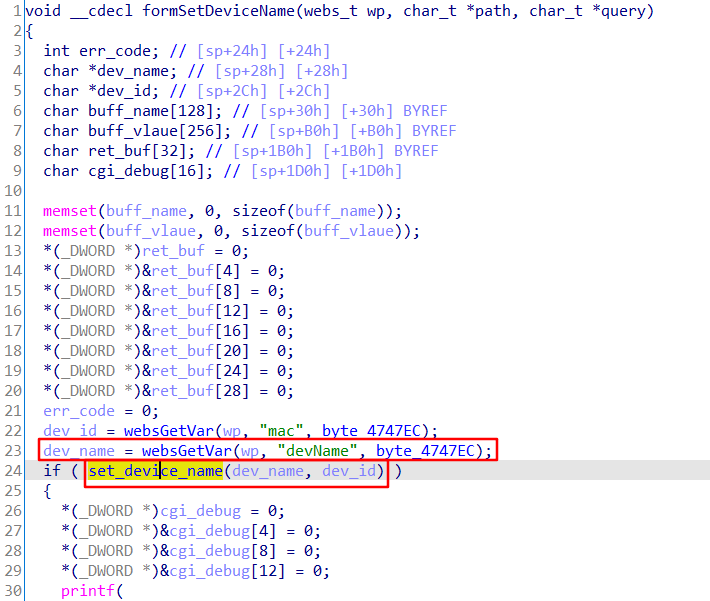
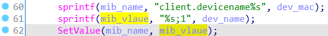
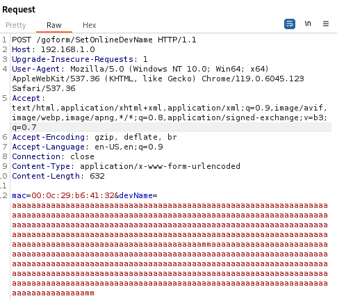
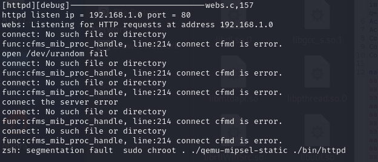

## Overview

- The device's official website: https://www.tenda.com.cn/product/A18.html

- Firmware download website: https://www.tenda.com.cn/download/detail-2760.html

## Affected version

V15.13.07.09

## Vulnerability details

The Tenda A18 V15.13.07.09 has a stack overflow vulnerability located in the `formSetDeviceName` function. This function accepts the `devName` parameter from a POST request and passes it to the `set_device_name` function. Within `set_device_name`, the array `mib_vlaue` is fixed at 256 bytes. However, since the user has control over the input of `devName`, the statement `sprintf(mib_vlaue, "%s;1", dev_name);` leads to a buffer overflow. The user-supplied `devName` exceeds the capacity of the `mib_vlaue` array, thus triggering this security vulnerability.

## PoC

